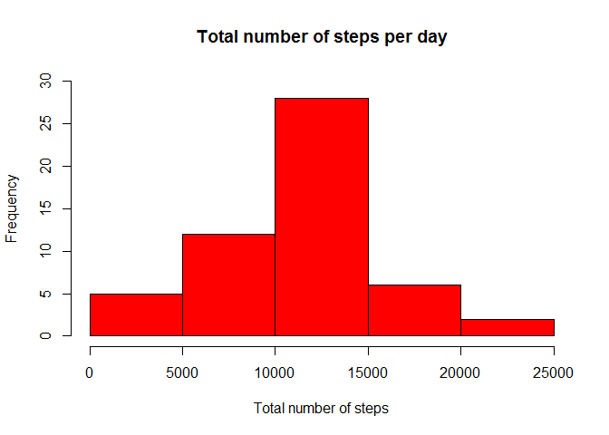
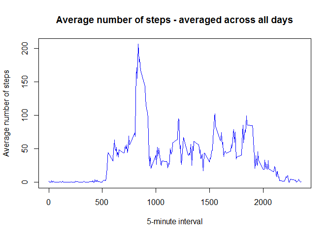
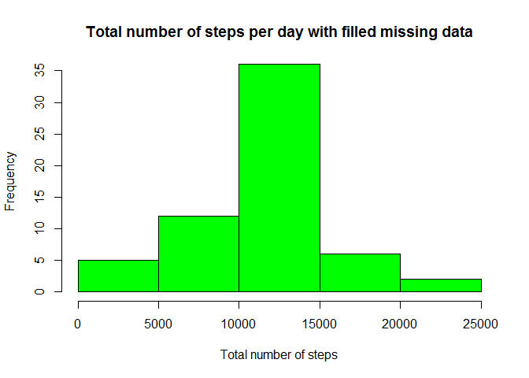
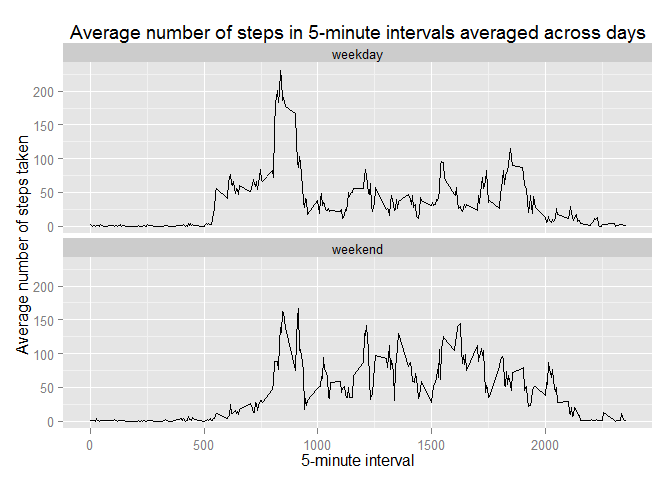

# Reproducible Research: Peer Assessment 1


### Before you begin

Please ensure the R working directory is set to the location of the 
"activity.csv" file.


## Loading and preprocessing the data

The following code will load the data as a data frame ("df").


```r
### 1. Load the data

        df <- read.csv ("activity.csv"
                        , stringsAsFactors = FALSE) # factors removed
```


The following code will: 

1. Create a data frame with "date" column transformed to date type ("df"). 

2. Create a data frame with complete cases (no NAs) only ("dfComplete").


```r
### 2. Process/transform the data (if necessary) into a format suitable for your analysis

        # Tranform "date"" column to date type
        df <- transform(df, date = as.Date(df$date))

        # Create df data frame that drops rows where "steps" is NA
        dfComplete <- df[complete.cases(df), ]
```


## What is mean total number of steps taken per day?

For this part of the assignment, any missing values in the dataset have been 
ignored.

The following code will:

1. Sum the number of steps by day (ie date).

2. Sum the number of steps by day and interval.


```r
        # Steps summed by date
        dfDay <- aggregate(df$steps ~ df$date, df, sum)
        colnames(dfDay) <- c("date", "steps")

        # Sum of steps per day aggregated by date and interval using complete cases
        library(plyr) # Load plyr library
        dfDayInt <- ddply(dfComplete, c("date", "interval")
                          , function(dfComplete)sum(dfComplete$steps))
        colnames(dfDayInt) <- c("date", "interval", "steps")
```


The following code will make a histogram of the total number of steps taken each day.


```r
### 1. Make a histogram of the total number of steps taken each day

        hist(dfDay$steps
             , col = "red"
             , main = "Total number of steps per day"
             , ylim = c(0, 30) # maximum freq at 30
             , xlab = "Total number of steps")
```

 


The following code calculates the mean and median total number of steps taken per day.


```r
### 2. Calculate and report the mean and median total number of steps taken per day

        # Mean of the total number of steps taken per day
        theMean <- mean(dfDay$steps)

        # Median of the total number of steps taken per day
        theMedian <- median(dfDay$steps)

        # Default option changed to not display numerals in scientific notation
        options(scipen = 1, digits = 2)
```


**The mean total number of steps taken per day is 10766.19.**

**The median total number of steps taken per day is 10765.**

**Thus, the mean and median number of daily steps are almost equal.**


## What is the average daily activity pattern?

The following code createa a time series plot of the 5-minute interval and the average number of steps taken, averaged across all days.


```r
### 1. Make a time series plot (i.e. type = "l") of the 5-minute interval (x-axis) and the average number of steps taken, averaged across all days (y-axis)

        # Average steps across all days
        dfAve <- aggregate(df$steps ~ df$interval
                            , df, mean) # NA ignored by default
        colnames(dfAve) <- c("interval", "steps")

        # Time series of 5-minute interval and the average number of steps, averaged across all days
        plot(dfAve$interval, dfAve$steps
             , type = "l" # lines
             , col = "blue"
             , main = "Average number of steps - averaged across all days"
             , ylim = c(0, max(dfAve$steps))
             , xlab = "5-minute interval"
             , ylab = "Average number of steps")
```

 

The following code determines which 5-minute interval averaged across all the days contains the maximum number of steps.


```r
### 2. Which 5-minute interval, on average across all the days in the dataset, contains the maximum number of steps?

# Maximum number of steps occurs at max(dfAve$steps)

        # 5-minute interval with the maximum number of steps        
        maxSteps <- dfAve[which(dfAve$steps == max(dfAve$steps)), 1]
```

**The 5-minute interval with the maximum number of steps (on average across all the days) is 835.**


## Imputing missing values

The following code calculates the total number of missing values in the dataset.


```r
### 1. Calculate and report the total number of missing values in the dataset (i.e. the total number of rows with NAs)

# The df data frame created above contains all cases.
# The dfComplete data frame contains all complete cases (no rows with NA).
# The total number of rows with NAs is the difference between the number of rows of these two data frames.

        rowsNA <- nrow(df) - nrow(dfComplete)
```

**The total number of missing values in the dataset is 2304.**


The following code provides a strategy to fill in all of the missing values in the dataset. The mean steps for corresponding 5 minute sessions are used to replace and NA step values. 


```r
### 2. Devise a strategy for filling in all of the missing values in the dataset. The strategy does not need to be sophisticated. For example, you could use the mean/median for that day, or the mean for that 5-minute interval, etc.

## Get the mean value for each 5 minute session

# Achieveved above with data frame "dfAve"" - steps averaged across all days.


## Merge the mean value into the original data

        # Merge df and dfAve data frames by interval
        dfMerge <- merge(df, dfAve, by = "interval")

        # Sort by interval then date
        dfMerge <- dfMerge[order(dfMerge$date, dfMerge$interval), ]
        colnames(dfMerge) <- c("interval", "steps", "date", "stepsMean")


## Find NA entries then set value to corresponding value in mean column

        for(i in 1:nrow(dfMerge)) {
                
                # If entry is NA
                if(is.na(dfMerge$steps[i])) {
                        
                        # Replace steps value with value in stepsMean column
                        dfMerge$steps[i] <- dfMerge$stepsMean[i]
                        
                        }
                   }
```

The following code creates a new dataset that is equal to the original dataset but with the missing data filled in.


```r
### 3. Create a new dataset that is equal to the original dataset but with the missing data filled in.

## Create data frame with columns steps, date, interval
 
        dfFilled <- cbind.data.frame(dfMerge$steps, dfMerge$date, dfMerge$interval)
        colnames(dfFilled) <- c("steps", "date", "interval")
```

The following code makes a histogram of the total number of steps taken each day. The mean and median total number of steps taken per day is calculated. 


```r
### 4. Make a histogram of the total number of steps taken each day and Calculate and report the mean and median total number of steps taken per day. Do these values differ from the estimates from the first part of the assignment? What is the impact of imputing missing data on the estimates of the total daily number of steps?

## Steps summed by date using dfFilled

        dfFilledDay <- aggregate(dfFilled$steps ~ dfFilled$date
                                         , dfFilled, sum)
                colnames(dfFilledDay) <- c("date", "steps")


## Histogram of the total number of steps taken each day

                hist(dfFilledDay$steps
                     , col = "green"
                     , main = "Total number of steps per day with filled missing data"
                     , ylim = c(0, 35)
                     , xlab = "Total number of steps")
```

 

```r
## Mean and median total number of steps taken per day

                # Mean of steps per day (date)
                dfFilledMean <- aggregate(dfFilled$steps ~ dfFilled$date, FUN = "mean")
                colnames(dfFilledMean) <- c("date", "steps")
        
                # Median of steps per day (date)
                dfFilledMedian <- aggregate(dfFilled$steps ~ dfFilled$date, FUN = "median")
                colnames(dfFilledMedian) <- c("date", "steps")
        
                # Bind mean and median steps per day
                dfFilledMM <- cbind(dfFilledMean, dfFilledMedian[ ,2])
                colnames(dfFilledMM) <- c("date (YYYY/MM/DD)"
                                          , "Mean steps"
                                          , "Median steps")
```

The following code assits to answer the questions regarding the mean/median number of steps calculated from the original dataset and the dataset with missing values filled in.


```r
        # Steps summed by date using dfFilled data frame
        dfDayFilled <- aggregate(dfFilled$steps ~ dfFilled$date, dfFilled, sum)
        colnames(dfDayFilled) <- c("date", "steps")

        # Mean of the total number of steps taken per day
        theMeanFilled <- mean(dfDayFilled$steps)

        # Median of the total number of steps taken per day
        theMedianFilled <- median(dfDayFilled$steps)

        # Default option changed to not display numerals in scientific notation
        options(scipen = 1, digits = 2)
```

#### Questions

*1. Do these values differ from the estimates from the first part of the assignment?*

*2. What is the impact of imputing missing data on the estimates of the total daily number of steps?*

#### Answers

**1. The mean total number of steps taken per day for complete cases versus imputing missing values is 10766.19 versus 10766.19.**

**The median total number of steps taken per day for complete cases versus imputing missing values is 10765 versus 10766.19.**

**Thus there is no difference in the mean value, and only a slight difference in the median value.**

**2. The impact of imputing missing data was minimal - the mean and median values did not change significantly. Comparisons between the two histograms indicate that the imputed values increase the frequency of average total steps (the middle bar of the green histogram).**


## Are there differences in activity patterns between weekdays and weekends?

The dataset with the filled-in missing values ("dfFilled" data frame) is used for this part.

The following code creates a new factor variable in the dataset with two levels - "weekday" and "weekend".


```r
### 1. Create a new factor variable in the dataset with two levels - "weekday" and "weekend" indicating whether a given date is a weekday or weekend day.

        # Craete column with either "weekday"" or "weekend""
        daysOfWeek <- weekdays(dfFilled$date)

        # Substitute Monday through to Friday with "weekday"
        daysOfWeek <- gsub("Monday", "weekday", daysOfWeek)
        daysOfWeek <- gsub("Tuesday", "weekday", daysOfWeek)
        daysOfWeek <- gsub("Wednesday", "weekday", daysOfWeek)
        daysOfWeek <- gsub("Thursday", "weekday", daysOfWeek)
        daysOfWeek <- gsub("Friday", "weekday", daysOfWeek)

        # Substitute Saturday and Sunday with "weekend"
        daysOfWeek <- gsub("Saturday", "weekend", daysOfWeek)
        daysOfWeek <- gsub("Sunday", "weekend", daysOfWeek)

        # Create data frame
        daysOfWeek <- as.data.frame(daysOfWeek)
        
        # Bind to dfFilled data frame
        dfFinal <- cbind.data.frame(dfFilled, daysOfWeek)
```

The following code makes a panel plot containing a time series plot of the 5-minute interval and the average number of steps taken, averaged across all weekday days or weekend days.


```r
### 2. Make a panel plot containing a time series plot (i.e. type = "l") of the 5-minute interval (x-axis) and the average number of steps taken, averaged across all weekday days or weekend days (y-axis).
 
        # Average steps across all days by intervals and daysOfWeek
        dfAveFinal <- ddply(dfFinal, c("interval", "daysOfWeek")
                            , function(dfFinal)mean(dfFinal$steps))
        colnames(dfAveFinal) <- c("interval", "daysOfWeek", "steps")

        # Time series of 5-minute interval and the average number of steps,
        # averaged across all days
        library(ggplot2)
        
        p <- ggplot(dfAveFinal, aes(x = interval, y = steps, group = daysOfWeek)) +
                geom_line() + 
                facet_wrap( ~ daysOfWeek, ncol = 1) +     
                ggtitle("Average number of steps in 5-minute intervals averaged across days") +
                xlab("5-minute interval") +
                ylab("Average number of steps taken")
                # NOTE: the "+"" must be at end of each line

        print(p)
```

 
